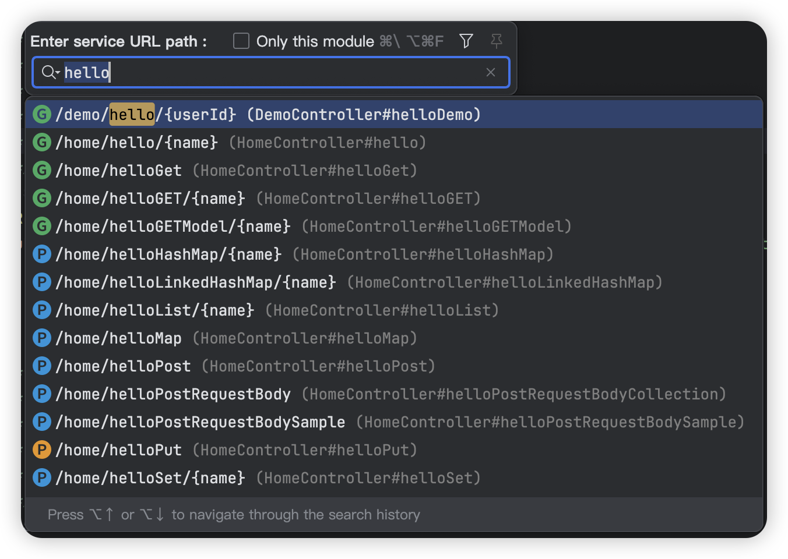

# Restful Finder For IntelliJ IDEA

[中文](README_zh_CN.md)

<!-- Plugin description -->
**Restful Finder** is a great Restful api search and quickly open and jump implementation code of Intellij IDEA toolkit. The toolkit supports Java languages,
Spring Framework (Spring Boot/Spring MVC).

The main goal of this template is to speed up the setup phase of plugin development for both new and experienced developers by preconfiguring the project scaffold and CI, linking to the proper documentation pages, and keeping everything organized.

[gh:template]: https://docs.github.com/en/repositories/creating-and-managing-repositories/creating-a-repository-from-a-template
<!-- Plugin description end -->

## What is RestfulFinder?

In the process of development and maintenance, interface addresses are often used to search for the corresponding implementation in the project. IDEA comes with a search function that can search any content, so it is not very friendly for people who want to search only the interface. This tool only search interface and quick jump code implementation, can bring better experience for your development!

## Features

- [x] Support for Java 11+, IDEA 2020.2+.
- [x] Supports Java languages, Spring framework (Spring Boot / Spring MVC).
- [x] Quick search url to navigate to service declaration. ( windows: Ctrl + \ or Ctrl + Alt + F  macos：Command + \ or Option + Command + F) .

Quick Search URL Preview

## Installation

- Using IDE built-in plugin system:

  <kbd>Settings/Preferences</kbd> > <kbd>Plugins</kbd> > <kbd>Marketplace</kbd> > <kbd>Search for "
  RestfulFinder"</kbd> >
  <kbd>Install Plugin</kbd>

- Manually:

  Download the [latest release](https://github.com/mustache-cn/RestfulFiner/releases/latest) and install it
  manually using
  <kbd>Settings/Preferences</kbd> > <kbd>Plugins</kbd> > <kbd>⚙️</kbd> > <kbd>Install plugin from disk...</kbd>

## License

RestfulFinder is under the Apache 2.0 license. See the [Apache License 2.0](http://www.apache.org/licenses/LICENSE-2.0) file for details..