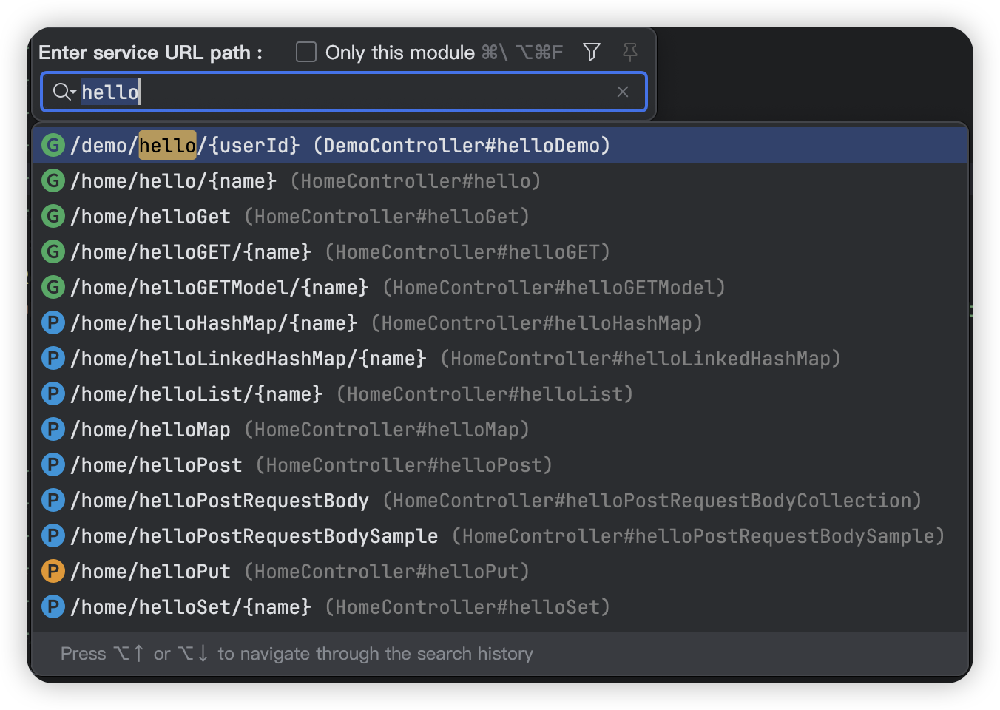

# Restful Finder For IntelliJ IDEA

[English](README.md)

## RestfulFinder?
在开发的维护的过程中，经常会用接口地址到项目中搜索相应的实现。IDEA自带搜索功能可以搜索任意内容，所以针对想只搜索接口来说不太友好。这个工具只搜索接口和快速跳转代码实现，能为你的开发带来更好体验！

---

## 功能及特性

- [x] 兼容 IDEA 2020.2及以上版本。
- [x] 支持 Java 语言,Spring framework (Spring Boot / Spring MVC)
- [x] 快捷搜索 REST URL 并直接定位到相应服务，比 IDEA 自带的 Search Anywhere 更快. ( windows: Ctrl + \ or Ctrl + Alt + F  macos：Command + \ or Option + Command + F) 。

快捷搜索 URL 预览

## 安装

- IDE 插件安装:

  <kbd>Settings/Preferences</kbd> > <kbd>Plugins</kbd> > <kbd>Marketplace</kbd> > <kbd>搜索 "
  Restful Finder"</kbd> >
  <kbd>安装插件</kbd>

- 手动安装:

  下载最新版 [latest release](https://github.com/mustache-cn/RestfulFinder/releases/latest) 然后手动安装，操作入口:
  <kbd>Settings/Preferences</kbd> > <kbd>Plugins</kbd> > <kbd>⚙️</kbd> > <kbd>Install plugin from disk...</kbd>

## License

RestfulFinder is under the Apache 2.0 license. See the [Apache License 2.0](http://www.apache.org/licenses/LICENSE-2.0) file for details.